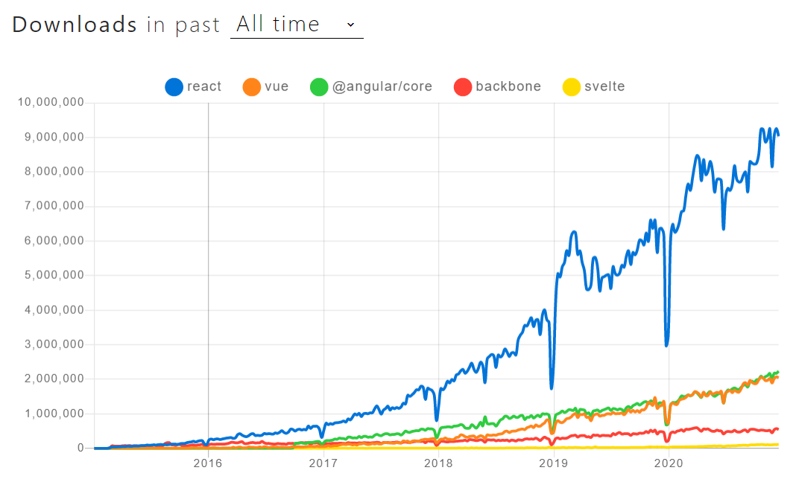

JavaScriptフレームワーク界が混沌としていた時代は終わりました。
現在はReact一強の時代です。日本ではVue.jsが次点でしょうか。

https://www.npmtrends.com/react-vs-vue-vs-@angular/core-vs-backbone-vs-svelte



JSはこのような状況ですが、CSS設計については今もなお混沌としています。
React、Vue.js、その他の各フレームワークごとにベストな方法を考えてみます。


## React

**CSS Modules > CSS in JS >>> Global CSS**

実は、ReactのドキュメントではCSSについてほとんど触れていません。
https://ja.reactjs.org/docs/faq-styling.html

そこで[Next.js](https://nextjs.org/docs/basic-features/built-in-css-support)と[Gatsby](https://www.gatsbyjs.com/docs/how-to/styling/)のドキュメントを参照してみます。
これらはReactを包んでいる有名なフレームワークです。
主に3つの方法があるようですね。

- **Global CSS**
    - サイト全体に適用されるCSSを書く
    - 昔からある方法
- **CSS Modules**
    - 各コンポーネントに適用されるCSSを書く
- **CSS in JS**
    - 各コンポーネントに適用されるCSSをJavaScriptの中に書く


### Global CSS

```html
<!-- app.html -->

<!DOCTYPE html>
<html lang="ja">
  <head>
    <!-- ... -->
    <link rel="stylesheet" type="text/css" href="app.css">
  </head>
  <!-- ... -->
</html>
```

```css
/* app.css */

.foo {
  background-color: black;
  color: white;
}
```

```jsx
// app.js

export default function App() {
  return <div className="foo">bar</div>
}
```

Reactに限らず、どのフレームワークでも採用できる方法ですね。
導入に必要な手順もなく、最もわかりやすいです。

しかし、アプリが大きくなるにつれて問題が発生しやすい方法でもあります。
グローバルにスタイルを適用するので、競合する可能性が高いのです。
CSS ModulesやCSS in JSがある現代において、あえて採用する必要はないでしょう。


### CSS Modules

```css
/* foo-component.module.css */

.foo {
  background-color: black;
  color: white;
}
```

```jsx
// foo-component.js

import styles from "./foo-component.module.css"

export default function FooComponent() {
  return <div className={styles.foo}>bar</div>
}
```

コンポーネントごとに対応するCSSを用意する方法です。
異なる`.module.css`で同じクラス名を定義しても競合が発生しません。

素のReactに導入するには[webpack](https://webpack.js.org/loaders/css-loader/#pure-css-css-modules-and-postcss)や[Parcel](https://parceljs.org/css.html#postcss)のようなバンドラへの設定が必要です。
Next.jsやGatsbyでは最初から使えます。


### CSS in JS

```jsx
// foo-component.js

import styled from "styled-components"

const Div = styled.div`
  background-color: black;
  color: white;
`

export default function FooComponent() {
  return <Div>bar</Div>
}
```

JSの中に各コンポーネントのCSSを書く方法です。スタイルを動的に変更したり、再利用することが簡単です。バンドラの設定も不要です。

しかし、CSS Modulesと比べると以下の欠点があります。

- パフォーマンスが悪い
    - [ベンチマーク](http://necolas.github.io/react-native-web/benchmarks/)
    - CSSファイルを作成せずに`<style>`を挿入するライブラリに関してはキャッシュできない問題もある
- デザイナーにJSのスキルが求められる
- ライブラリによって書き方が異なる
    - 上のコードは現時点でデファクトに近い[styled-components](https://styled-components.com/)の例
    - 最近は[linaria](https://github.com/callstack/linaria)が熱いらしく、主流が変わるたびに移行の検討が必要
        - ただしlinariaはstyled-componentsの書き方もサポートしている様子

以上からReactにおけるCSS設計は、今のところCSS Modulesのほうが良い印象です。
参考になりそうなリンクを挙げておきます。

- [Next.js が CSS Modules を推奨する真相に迫りたい](https://zenn.dev/takepepe/scraps/6668e9fe402666)
- [Next.jsにCSS Modulesを導入する](https://zenn.dev/catnose99/scraps/5e3d51d75113d3)
- [SPAにおけるCSSについて、もうひとつの解 - @yoshiko_pg](https://yoshiko-pg.github.io/slides/20180419-scramble/)

---

なお、[css-loader](https://github.com/webpack-contrib/css-loader)のIssueに書かれた[こちらのコメント](https://github.com/webpack-contrib/css-loader/issues/1050?#issuecomment-592541379)を根拠に、CSS Modulesは廃止される可能性が高い、という意見があります。
css-loaderはwebpackでCSS Modulesを実現するライブラリです。

結論としては特に心配する必要はありません。
[その後のコメント](https://github.com/webpack-contrib/css-loader/issues/1050?#issuecomment-729606066)にある通り、廃止されたとしても別のライブラリに分かれるだけでしょう。


## Vue.js

**CSS Modules > Scoped CSS**

Vue.jsには**単一ファイルコンポーネント**という仕組みがあります。

```html
<template>
  <div class="example">{{ msg }}</div>
</template>

<script>
export default {
  data () {
    return {
      msg: 'Hello world!'
    }
  }
}
</script>

<style>
.example {
  color: red;
}
</style>
```

`<style>`タグに何も加えないとグローバルに適用されます。すでに上で書いたように、競合しやすいので避けましょう。

`scoped`を加えると**Scoped CSS**、`module`を加えると**CSS Modules**になります。


### Scoped CSS

```html
<template>
  <div class="example">Hello world!</div>
</template>

<style scoped>
.example {
  color: red;
}
</style>
```

コンパイル後は以下のようになります。

```html
<template>
  <div class="example" data-v-f3f3eg9>Hello world!</div>
</template>

<style>
.example[data-v-f3f3eg9] {
  color: red;
}
</style>
```

コンポーネントごとに固有の`data`属性を加えるため、スタイルが競合しにくいです。

ただし、グローバルに適用するCSSが存在する場合は競合する可能性があります。
上の例だと、グローバルなCSSで`.example`にスタイルを適用していると競合しますね。


### CSS Modules

```html
<template>
  <div :class="$style.example">Hello world!</div>
</template>

<style module>
.example {
  color: red;
}
</style>
```

コンパイル後は以下のようになります。

```html
<template>
  <div class="_1VyoJ-uZOjlOxP7jWUy19_0">Hello world!</div>
</template>

<style>
._1VyoJ-uZOjlOxP7jWUy19_0 {
  color: red;
}
</style>
```

クラス名自体を変換するため、グローバルなCSSがあっても競合しにくいです。

以上からVue.jsにおけるCSS設計も基本的にはCSS Modulesを推奨します。


## その他

ReactやVue.js以外にもクライアント側でHTMLを組み立てるフレームワークがあります。[AngularJS](https://angularjs.org/)や[Svelte](https://svelte.dev/)などですね。

それらについてはそのフレームワークが推奨するCSS設計に従いましょう。
例えばSvelteはVue.jsと似た書き方ができます。

```html
<div class="example">Hello world!</div>

<style>
  .example {
    color: red;
  }
</style>
```

JSフレームワークを使わずにサーバ側でHTMLを組み立てるという選択肢もあります。
その場合はグローバルなCSSを使わなくてはいけません。
設計方法にはいくつかの種類がありますが、おすすめは[BEM](https://en.bem.info/methodology/quick-start/) + [FLOCSS](https://github.com/hiloki/flocss)です。


## まとめ

フレームワークごとにベストなCSS設計を考えてみました。
改めてまとめます。

- React
    - **CSS Modules > CSS in JS >>> Global CSS**
- Vue.js
    - **CSS Modules > Scoped CSS**
- その他
    - フレームワークが推奨する方法に従う
    - **BEM + FLOCSS**

選択肢が多いので選定が難しいですね。
来年にはまた変わっていそうなので、定期的に情報を整理したいと思います。
