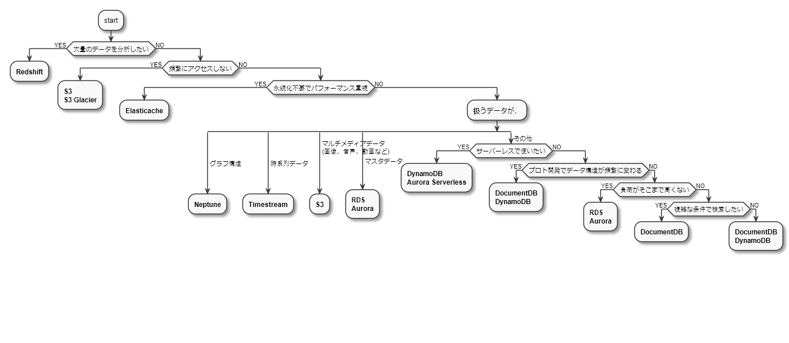

(PlantUMLで作成)

2020/12/03 追記
現在はRDS Proxyを使用することで、サーバーレスでもRDSを使いやすくなっています。

## はじめに

新しくサービスを作るたびにデータストアの選定を行いますが、チャートがあると便利かな、と思ったので作りました。
なお、私はインフラエンジニアではないので、参考程度に見ていただけると幸いです。
このチャートに沿っていないデータベースが不適切というわけではありません。

ちなみにAWS編以外の編は予定しておりませんので、あしからず。

## S3

オブジェクトストレージ。
基本的にはオブジェクト単位で扱うので、データの一部で検索したり、一部だけ更新したりすることは苦手。
(検索に関しては`S3 Select`や`Athena`などを使えば可能)
音声、画像、ログなどの非構造化データや、アプリに対して1つだけ用意すれば良い設定ファイルなどの保存先に適している。
**S3 Glacier**はアクセス頻度が少なく、長期保存するデータ向け。

## Redshift

データウェアハウス。
S3や他のDBからデータをロードし、分析を行う。

## Elasticache

キーバリュー型のNoSQL(KVS)。
インメモリにデータを保持し、ミリ秒未満のリアルタイムな処理が必要なユースケースで使用する。
一応パフォーマンスを犠牲にして永続化することも可能だが、長所を活かせないので別のDBと併用するのが無難。

## Neptune

グラフ型のNoSQL。
ソーシャルネットワークや交通網のような、グラフ構造のデータを扱うのに適している。

## Timestream

時系列データ(タイムスタンプをキーにしたデータ)に最適化されたDB。
IoTやアプリのモニタリングなどに使用する。

## RDS

リレーショナルDB。
ACID特性を満たすため、強い整合性が必要なデータに適している。
その代わりにスケールアウトが難しく、大量のデータを扱うのには適さない。
また、スキーマを定義しておく必要があるので、データ構造が頻繁に変わるプロト開発時にも向かない。

## Aurora

データモデルや基本的な用途はRDSと同様。
クラウド向けに最適化し、パフォーマンスや耐障害性を向上している。
その分、料金はRDSより割高。

## Aurora Serverless

Auroraのサーバーレス版。
Data API経由でアクセスすることによって最大コネクション数の問題を回避できるので、Lambdaからも使用できる。

## DynamoDB

ドキュメント型の特徴も持つキーバリュー型のNoSQL(KVS)。
1つのキーに対して複数の値を持たせたり、範囲のあるキーを定義したりできる。
サーバーレスで自動的にスケールするので、Lambdaと相性が良い。
あくまでKVSなので複雑な検索や更新は苦手。

## DocumentDB

ドキュメント型のNoSQL。
MongoDB互換で複雑な構造のデータも扱いやすい。

## 参考

- [AWSが提供するクラウドデータベース](https://aws.amazon.com/jp/products/databases/)
- [AWSが提供するクラウドストレージサービス](https://aws.amazon.com/jp/products/storage/)

