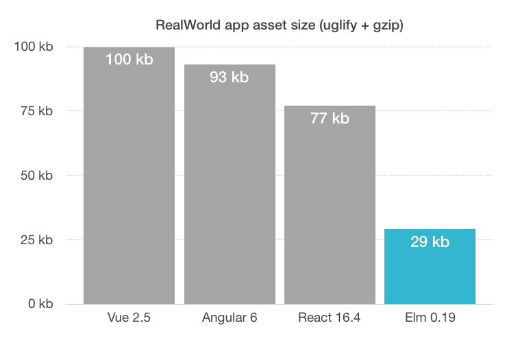
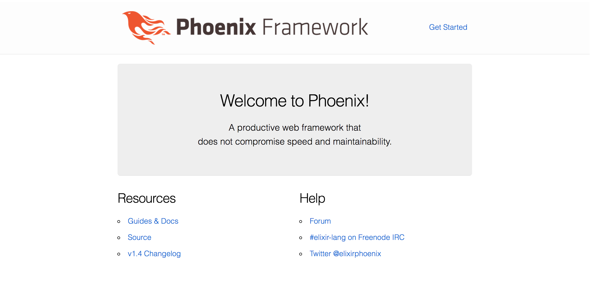
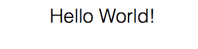
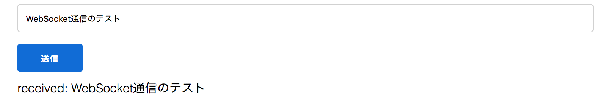

## 背景

Elm 0.19が8月、Phoenix 1.4が11月にリリースされました！
Elmについてはコンパイルが爆速になったり、成果物のサイズが小さくなったり、標準ライブラリのAPIに破壊的変更が入ったりなど、大きな変更が加えられました。(詳しくは[こちら](https://github.com/elm/compiler/blob/master/upgrade-docs/0.19.md))



PhoenixについてもHTTP2のサポートが入ったり、JSのバンドラーがBrunchからWebpackになったりしました。(詳しくは[こちら](https://phoenixframework.org/blog/phoenix-1-4-0-released))

それぞれの変更に伴い、Elm + Elixir/PhoenixでWebSocket通信を行う方法が変わりました。この記事ではその手順をまとめます。

## プロジェクト作成まで
### Elmインストール
1. Node.jsインストール
    - OSによるため公式を参照: https://nodejs.org/ja/download/
2. `$ npm install -g elm`
3. `$ elm`

```
Hi, thank you for trying out Elm 0.19.0. I hope you like it!
...
```

### Elixir/Phoenixインストール
1. Elixirインストール
    - OSによるため公式を参照: https://elixir-lang.org/install.html
2. `$ mix local.hex`
3. `$ mix archive.install hex phx_new 1.4.0`
4. `$ mix archive`

```
...
* phx_new-1.4.0
```

### プロジェクト作成
1. `$ mix phx.new elm_websocket_sample --no-ecto`
    - `elm_websocket_sample`はプロジェクト名(適宜変更)
    - `--no-ecto`はDBを使わない設定
2. 依存関係のインストールを行うか聞かれるのでEnter
3. `$ cd elm_websocket_sample`
4. `$ mix phx.server`
5. ブラウザでhttp://localhost:4000/ にアクセスして以下の画面が表示されればOK



以下、トップの`/`はプロジェクトルートとします。
例えば`cd /lib`はプロジェクトルート直下の`lib/`に`cd`するという意味です。

## Elmで画面表示
1. `$ mkdir /assets/elm`
2. `$ cd /assets/elm`
3. `$ elm init`
    - elm.jsonを作成するか聞かれるのでEnter
4. Main.elm

```elm
-- /assets/elm/Main.elm

module Main exposing (main)

import Browser
import Html exposing (..)
import Html.Attributes exposing (..)


-- MODEL


type alias Model
    = {}

init : () -> ( Model, Cmd Msg )
init _ =
    ( {}, Cmd.none )


-- VIEW


view : Model -> Html Msg
view model =
    div [] [ text "Hello World!" ]


-- UPDATE


type alias Msg
    = {}


update : Msg -> Model -> ( Model, Cmd Msg )
update msg model =
    ( model, Cmd.none )


-- SUBSCRIPTIONS


subscriptions : Model -> Sub Msg
subscriptions model =
    Sub.none


-- MAIN


main : Program () Model Msg
main =
    Browser.element
        { init = init
        , view = view
        , update = update
        , subscriptions = subscriptions
        }
```

5. app.js

```js
// /assets/js/app.js

// ...

import { Elm } from "../elm/src/Main.elm"

Elm.Main.init({
    node: document.getElementById("elm-container")
})
```

6. `$ cd /assets`
7. `$ npm install --save-dev elm-webpack-loader`
8. webpack.config.js

```js
// /assets/webpack.config.js

module.exports = (env, options) => ({
    // ...
    module: {
    rules: [
        // ...
        {
        test: /\.elm$/,
        exclude: [/elm-stuff/, /node_modules/],
        use: {
            loader: 'elm-webpack-loader',
            options: {
            cwd: __dirname + "/elm"
            }
        }
        }
    ]
    },
    // ...
});
```

9. `/lib/elm_websocket_sample_web/templates/layout/app.html.eex`の`<header>`を削除
10. index.html.eex

```html
<!-- /lib/elm_websocket_sample_web/templates/page/index.html.eex -->
<div id="elm-container"></div>
```

11. `$ mix phx.server`
12. ブラウザでhttp://localhost:4000/ にアクセスして以下の画面が表示されればOK



## WebSocket実装
### Phoenix側
1. `$ mix phx.gen.channel Room`
2. user_socket.ex

```elixir
# /lib/elm_websocket_sample_web/channels/user_socket.ex

defmodule ElmWebsocketSampleWeb.UserSocket do
    use Phoenix.Socket

    ## Channels
    channel "room:*", ElmWebsocketSampleWeb.RoomChannel # ← コメントアウトを解除

    # ...
end
```

### Elm側
Elm 0.18までは公式のライブラリでWebSocketがサポートされていたのですが、0.19では現時点で存在しません。
そのため、WebSocket通信を行うにはJavaScriptを通して行う必要があります。
[elm-phoenix-websocket-ports](https://github.com/paulstatezny/elm-phoenix-websocket-ports)というライブラリが使いやすかったのでそちらを使用した方法を紹介します。

1. `$ cd /assets`
2. `$ npm install elm-phoenix-websocket-ports`
3. elm.json

```json
// /assets/elm/elm.json

{
    "type": "application",
    "source-directories": [
        "../node_modules/elm-phoenix-websocket-ports/lib/elm",
        ...
    ],
    ...
}
```

4. `$ cd /assets/elm`
5. `$ elm install elm/json`
6. Main.elm

```elm
-- /assets/elm/Main.elm

module Main exposing (main)

import Browser
import Html exposing (..)
import Html.Attributes exposing (..)
import Html.Events exposing (..)
import Json.Decode as D
import Json.Encode as E
import Ports.Websocket as Websocket


-- MODEL


type alias Model =
    { inputText : String
    , receivedText : String
    }

init : () -> ( Model, Cmd Msg )
init _ =
    ( { inputText = ""
        , receivedText = ""
        }
    , Websocket.websocketListen ("room:lobby", "shout")
    )


-- VIEW


view : Model -> Html Msg
view model =
    div
        []
        [ div
            []
            [ input
                [ type_ "text"
                , onInput UpdateInputText
                ]
                []
            , button
                [ onClick (Send model.inputText) ]
                [ text "送信" ]
            ]
        , div
            []
            [ text <| "received: " ++ model.receivedText ]
        ]


-- UPDATE


type Msg
    = WebsocketReceive (String, String, D.Value)
    | UpdateInputText String
    | Send String


update : Msg -> Model -> ( Model, Cmd Msg )
update msg model =
    case msg of
        WebsocketReceive ("room:lobby", "shout", payload) ->
            case D.decodeValue textDecoder payload of
                Ok receivedText ->
                    ( { model | receivedText = receivedText }, Cmd.none )

                Err _ ->
                    ( model, Cmd.none )

        WebsocketReceive (_, _, _) ->
            ( model, Cmd.none )

        UpdateInputText inputText ->
            ( { model | inputText = inputText }, Cmd.none )

        Send inputText ->
            ( model, Websocket.websocketSend ( "room:lobby", "shout", textEncoder inputText ) )


textDecoder : D.Decoder String
textDecoder =
    D.at ["data"] D.string


textEncoder : String -> E.Value
textEncoder string =
    E.object
        [ ( "data", E.string string ) ]


-- SUBSCRIPTIONS


subscriptions : Model -> Sub Msg
subscriptions model =
    Websocket.websocketReceive WebsocketReceive


-- MAIN


main : Program () Model Msg
main =
    Browser.element
        { init = init
        , view = view
        , update = update
        , subscriptions = subscriptions
        }
```

7. app.js

```js
// /assets/js/app.js

// ...

import * as phoenix from "phoenix"
import websocketPortsFactory from "elm-phoenix-websocket-ports"

import { Elm } from "../elm/src/Main.elm"

const socketAddress = "/socket"
const websocketPorts = websocketPortsFactory(phoenix, socketAddress)

const elm = Elm.Main.init({
    node: document.getElementById("elm-container")
})

websocketPorts.register(elm.ports)
```

8. `$ mix phx.server`
9. ブラウザでhttp://localhost:4000/ にアクセスし、inputに入力して送信ボタンを押すとメッセージが送られます。Phoenixでは受け取った文字列を接続中のクライアントすべてに返し、Elmで受け取った結果が`received: `に表示されます。タブを２つ以上開いておくと送信していないタブでも表示されるはずです。



## 解説
### Phoenix側
Phoenixには、WebSocketでの送受信に関する処理を行うChannelというモジュールが用意されています。
`$ mix phx.gen.channel Room`というコマンドを実行すると、"RoomChannel"が自動で作成されます。

```elixir
# /lib/elm_websocket_sample_web/channels/room_channel.ex

defmodule ElmWebsocketSampleWeb.RoomChannel do
  use ElmWebsocketSampleWeb, :channel

  def join("room:lobby", payload, socket) do
    if authorized?(payload) do
      {:ok, socket}
    else
      {:error, %{reason: "unauthorized"}}
    end
  end

  # ...

  def handle_in("shout", payload, socket) do
    broadcast socket, "shout", payload
    {:noreply, socket}
  end

  defp authorized?(_payload) do
    true
  end
end
```

- `join("room:lobby", payload, socket)`
    - "room:lobby"というトピックの定義と、購読時の処理の実装です。
    - `authorized?`がtrueの場合はok, falseの場合はerrorを返します。
- `handle_in("shout", payload, socket)`
    - "shout"というイベントのメッセージを受信した時の処理の実装です。
    - `payload`は受信したメッセージです。
    - `socket`はメッセージの送信元とのソケットです。
    - `broadcast`の部分では、`socket`と同じトピック(ここでは"room:lobby")を購読しているクライアントに対し、受信したメッセージを"shout"というイベントでそのまま送信しています。
- `authorized?(_payload)`
    - メッセージをもとに認証を行う処理の実装ですが、デフォルトでは常にtrueを返しています。

### Elm側
```elm
-- ...

init : () -> ( Model, Cmd Msg )
init _ =
    ( { inputText = ""
      , receivedText = ""
      }
    , Websocket.websocketListen ("room:lobby", "shout")
    )

-- ...
```

- `Websocket.websocketListen ("room:lobby", "shout")`
    - "room:lobby"というトピックの"shout"というイベントのメッセージを受信できるように登録しています。

```elm
-- UPDATE


type Msg
    = WebsocketReceive (String, String, D.Value)
    -- ...
    | Send String


update : Msg -> Model -> ( Model, Cmd Msg )
update msg model =
    case msg of
        WebsocketReceive ("room:lobby", "shout", payload) ->
            case D.decodeValue textDecoder payload of
                Ok receivedText ->
                    ( { model | receivedText = receivedText }, Cmd.none )
                -- ...
        -- ...

        Send inputText ->
            ( model, Websocket.websocketSend ( "room:lobby", "shout", textEncoder inputText ) )


textDecoder : D.Decoder String
textDecoder =
    D.at ["data"] D.string


textEncoder : String -> E.Value
textEncoder string =
    E.object
        [ ( "data", E.string string ) ]
```


- `WebsocketReceive ("room:lobby", "shout", payload)`
    - "room:lobby"というトピックの"shout"というイベントのメッセージを受信したときの処理の実装です。
    - JSONをデコードし、modelの`receivedText`にセットしています。
- `Send inputText`
    - 文字列をJSONにエンコードし、"room:lobby"というトピックの"shout"というイベントでメッセージを送信する処理の実装です。
- textDecoder
    - JSONのデコーダです。
    - `{ "data": "foo" }`の`"foo"`を取り出す実装になっています。
- textEncoder
    - JSONのエンコーダです。
    - `"foo"`を`{ "data": "foo" }`に変換する実装になっています。

```elm
-- SUBSCRIPTIONS


subscriptions : Model -> Sub Msg
subscriptions model =
    Websocket.websocketReceive WebsocketReceive
```

`Websocket.websocketListen`で受信したメッセージを処理する関数を登録しています。

## まとめ
Elm 0.19 + Elixir/Phoenix 1.4でWebSocket通信を行う実装例を紹介しました。
参考になれば幸いです。

