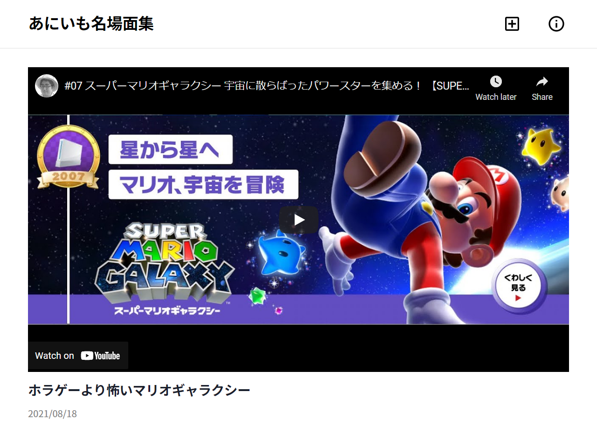

- サイト
    - https://ani-imo-scenes.com/
- コード
    - https://github.com/Foo-x/ani-imo-scenes

## 背景

個人的に好きな兄妹 YouTuber がいます。

- [帰ってきたら兄の部屋でゲームをしてる妹ちゃんねる](https://www.youtube.com/channel/UCxM9OJy4o6mqZaaT2kpfwKA)
- [ヒヨブー [兄部屋のあにはん]](https://www.youtube.com/channel/UCU8K9Lbjup7FcNQu7IL_UTA)
- [hiyobu](https://www.youtube.com/user/hiyobu)

おふたりの主な活動は主に1時間以上の生配信です。
そのため、視聴者による切り抜きがよく作られています。

私は、名場面を集めたサイトを作ることにしました。

## 方針

最初は他の方と同じように切り抜きを作ろうかと思いましたが、[YouTube の利用規約](https://www.youtube.com/static?template=terms) で動画のダウンロードはNGです。（実状はグレー？適切な方法を知りたい）

> The following restrictions apply to your use of the Service. You are not allowed to:
>
> 1. access, reproduce, download, distribute, transmit, broadcast, display, sell, license, alter, modify or otherwise use any part of the Service or any Content except: (a) as expressly authorized by the Service; or (b) with prior written permission from YouTube and, if applicable, the respective rights holders;

また、毎回編集してエンコードするのが面倒でした。

最終的には YouTube の埋め込み動画を使うことにしました。
編集を加えることはできませんが、動画のURLと開始・終了のタイムスタンプさえあれば良いのが圧倒的に楽なためです。

## 使用技術

- 言語
    - [TypeScript](https://www.typescriptlang.org/)
- フレームワーク
    - [Gatsby](https://www.gatsbyjs.com/)
- 主なライブラリ
    - [React Hook Form](https://react-hook-form.com/)
        - フォームの状態管理とバリデーション
    - [react-youtube](https://github.com/tjallingt/react-youtube)
        - YoutTube 埋め込み動画の生成と状態管理
    - [Dexie.js](https://dexie.org/)
        - スプレッドシートから取得した動画情報の保存
    - [fake-indexeddb](https://github.com/dumbmatter/fakeIndexedDB)
        - FireFox のプライベートモードなど、IndexedDB を使用できない環境での動画情報の保存
    - [color-system](https://github.com/Foo-x/color-system)
        - カラーコードの統一
        - 拙作
    - [Material Icons](https://fonts.google.com/icons)
        - アイコン
    - [gatsby-plugin-typegen](https://www.gatsbyjs.com/plugins/gatsby-plugin-typegen/)
        - GraphQL の型定義生成
    - [typescript-plugin-css-modules](https://github.com/mrmckeb/typescript-plugin-css-modules)
        - CSS Modules の型付け
- データストア
    - [Google Sheets](https://www.google.com/sheets/about/)
    - [Google Apps Script](https://developers.google.com/apps-script)
- ホスティング
    - [GitHub Pages](https://pages.github.com/)
- ドメイン・DNS
    - [お名前.com](https://www.onamae.com/)

データストアとして初めて Google Sheets + Google Apps Script を採用してみました。
下が制限ですが、複雑な検索が不要かつ負荷が高くなければ、無料アカウントでも十分使えますね。
https://developers.google.com/apps-script/guides/services/quotas

実装時のハマりポイントは気が向いたら別の記事を作ります。

## 今後の予定

- 動画の追加
- 検索機能
    - ソート
    - フィルタ
- 遅延読み込み
