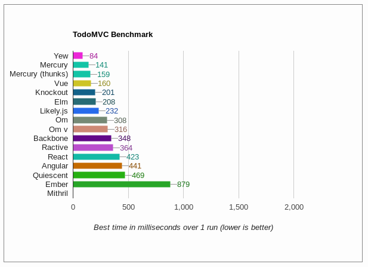

## 始めに
少しずつWebAssemblyを使用したWebアプリが現実的になってきましたね！
つい最近も、WebAssemblyにコンパイルされるC#用Webフレームワークの記事が話題になりました。
[C# で Single Page Web Application が書ける Blazor が凄かった件](https://qiita.com/jsakamoto/items/20d4893f6c8cdb0356f6)

ここではC#ではなく、Rust用のクライアントサイドWebフレームワークである**Yew**を紹介します。
Yewには以下のような特徴があります。

- Elm風のアーキテクチャ
- JSX風のテンプレート
- WebAssemblyへのコンパイル

それぞれ実際のコードを交えながら説明していきます。

なお、Yewのリポジトリは下です。
https://github.com/DenisKolodin/yew
この記事に出てくるコードはすべてこのリポジトリ内にあるものです。(2018/03/17時点)

## Elm風のアーキテクチャ
Elmとは、Webアプリを作成するために開発された純粋関数型言語です。
関数型言語は学習曲線が急になりがちですが、作者のEvanさんが教育系の企業であるNoRedInkで働いているからか、Elmはとても開発者フレンドリーです。
影響されているHaskellに比べ、必要な機能のみに絞ってシンプルにし、ドキュメントやサンプルが充実しています。

また、Elmで書かれたコードは美しいです。
その美しさの要因はシンプルかつ厳密なシンタックスと、そのアーキテクチャ(**The Elm Architecture; TEA**)です。

詳細は他の記事に譲りますが、ここではElmアーキテクチャが下の要素で構成されていることだけ理解していれば十分です。

- **Model**: 状態
- **Update**: Modelの更新処理
- **View**: 画面の作成処理

イベントを受け取り、UpdateでModelを更新し、それをもとにViewを返します。

YewでElmアーキテクチャを実現している部分のコードです。

```rust
struct Model { }

enum Msg {
    DoIt,
}

impl Component<Context> for Model {
    // Some details omitted. Explore the examples to get more.

    type Msg = Msg;
    type Properties = ();

    fn create(_: Self::Properties, _: &mut Env<Context, Self>) -> Self {
        Model { }
    }

    fn update(&mut self, msg: Self::Msg, _: &mut Env<Context, Self>) -> ShouldRender {
        match msg {
            Msg::DoIt => {
                // Update your model on events
                true
            }
        }
    }
}

impl Renderable<Context, Model> for Model {
    fn view(&self) -> Html<Context, Self> {
        html! {
            // Render your model here
            <button onclick=|_| Msg::DoIt,>{ "Click me!" }</button>
        }
    }
}
```

`struct Model { }`でModelを定義し、
`impl Component<Context> for Model`でModelの初期状態とUpdateを定義し、
`impl Renderable<Context, Model> for Model`でViewを定義しています。
Yewは上のように、ElmアーキテクチャでWebアプリを作成するアプローチをとっています。

## JSX風のテンプレート
上のコードでも少し現れましたが、YewはJSX風のテンプレートを記述できます。

```rust
html! {
    <section class="todoapp",>
        <header class="header",>
            <h1>{ "todos" }</h1>
            { view_input(&model) }
        </header>
        <section class="main",>
            <input class="toggle-all",
                   type="checkbox",
                   checked=model.is_all_completed(),
                   onclick=|_| Msg::ToggleAll, />
            { view_entries(&model) }
        </section>
    </section>
}
```

これはRustのマクロ機能によるもので、`html! { }`内の文字列をマクロによってRustのコードに変換しています。

コンポーネントや、

```rust
html! {
    <nav class="menu",>
        <MyButton: title="First Button",/>
        <MyButton: title="Second Button",/>
    </nav>
}
```

フラグメントなどをサポートしています。

```rust
html! {
    <>
        <tr><td>{ "Row" }</td></tr>
        <tr><td>{ "Row" }</td></tr>
        <tr><td>{ "Row" }</td></tr>
    </>
}
```

JSX風と書いたように、すべての機能はサポートしておらず、書き方も若干異なります。

## WebAssemblyへのコンパイル
Yewのアプリは[cargo-web](https://github.com/koute/cargo-web)を使用してビルドします。
デフォルトではasm.jsで出力されますが、コンパイルターゲットに`wasm32-unknown-emscripten`や`wasm32-unknown-unknown`を追加することでWebAssemblyにコンパイルされます。
最初の環境構築に少し手間がかかります(といってもコマンドを何個か入力するだけです)が、WebAssemblyで実行されるため処理が速いです。
もちろん1度環境を構築してしまえば2回目以降は不要です。

実際、Yewのサンプルアプリとして公開されている[large-table](https://github.com/DenisKolodin/yew/tree/master/examples/large_table)はasm.jsだとまともに動きませんが、WebAssemblyだと少し重いですがちゃんと動きました。

また、WebAssemblyのファイルサイズですが、サンプルアプリの[todomvc](https://github.com/DenisKolodin/yew/tree/master/examples/todomvc)を普通にビルド(`cargo web build`)すると**2.1MB**でした。(`todomvc.wasm`)
リリースビルド(`cargo web build --release`)にすると最適化されて**466KB**でした。
コードの規模に対して少し大きいですが、許容範囲ではないでしょうか。
ただやはり現時点でWebAssemblyが一番活きるのは小さいコードで重い処理を行う場合だと思います。

ちなみにYewの開発者本人がパフォーマンスを測定しています。
https://github.com/DenisKolodin/yew/issues/5#issuecomment-354777076
ソース: https://github.com/DenisKolodin/todomvc-perf-comparison


## まだ実験段階です
Blazorもそうですが、Yewも例によって実験段階です。
どちらも昨年の12月上旬にリポジトリが作成されており、最初のコミットからまだ3ヶ月ほどしか経っていません。(※追記 Blazorは個人プロジェクトとして昨年の5月には存在していました)
ドキュメントもREADMEレベルのものしかないです。
C#で書かれているBlazorと違い、Rustはまだ歴史が浅い言語なのでライブラリも少ないはずです。
プロダクションで利用可能になるまでは、着実に近づいてはいますが、まだしばらく先だと思います。

また、AltJSとして見た場合、JavaScriptの資産を使うのは現実的ではありません。
(一応WebAssemblyとJavaScriptの間で相互にアクセスするAPIはあります)
どうしてもJSの資産を使いたい場合は素直にTypeScriptを使い、Rustで完結できる場合のみYewを採用するほうが幸せだと思います。

## 最後に
Rust用WebフレームワークのYewを紹介しました。
私自身あまり触れていないので深いところまで紹介できませんでしたが、最初に挙げた記事に触発され、この波に乗り遅れるわけにはいかないと思って急いで書いてしまいました。

そもそもなぜクライアントサイドをJavaScriptで書かないのかとか、なぜWebAssemblyにコンパイルするのか、といった部分はこの記事では書きませんでした。
AltJSやWebAssemblyのモチベーションについては素晴らしい記事がたくさんあるので、もし上のような疑問がある場合は探してみてください。
また、なぜRustなのかが気になる場合も、Rustの素晴らしさを解説した記事がたくさんあるはずなのでぜひ探してみてください。
