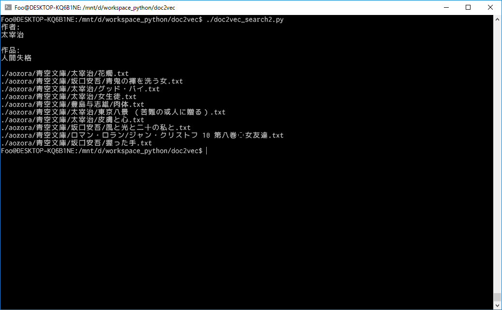

Doc2Vecで類似文章を検索してみたので、実装を紹介します。

## Doc2Vecとは
コンピュータが自然言語を処理するためには、まず人間の言葉をコンピュータで扱える値にする必要があります。
単語の意味をベクトル化する手法として[Word2Vec]が存在します。
詳しくはリンク先がとてもわかりやすいのですが、ざっくり言うと前後n単語のリストでその単語を表現します。
こうすることで、例えば「犬」と「猫」は同じような文脈で使われるため、似た「意味」であると考えることができます。
Doc2VecはWord2Vecを応用し、文章をベクトル化するものです。

## 実装サンプル
今回Doc2Vecを用いて実現するのは、以下の2つの機能です。

* 単語で文章を検索
* 類似文章の検索

サンプルとして、青空文庫の文章を使用しました。
なお、この記事で使用するコードは[GitHubで公開しています][GitHub]。
(学習に使用した文章もzipにしましたが、サイズが大きいので注意してください)

### 環境
* Python 3
* MeCab
* gensim

を使えるようにしてください。

### 学習
1. 文章のファイルを取得
2. ファイルから文章を取得
3. 文章から不要な部分を削除
4. 単語に分解
5. Doc2Vecで学習
6. 学習データを出力

の流れで処理します。

#### 1. 文章のファイルを取得
```py
import os
import sys
import MeCab
import collections
from gensim import models
from gensim.models.doc2vec import LabeledSentence
```

まずは必要ライブラリのインポートです。

```py
def get_all_files(directory):
    for root, dirs, files in os.walk(directory):
        for file in files:
            yield os.path.join(root, file)
```

与えられたディレクトリ以下のファイルをすべて取得します。

#### 2. ファイルから文章を取得
```py
def read_document(path):
    with open(path, 'r', encoding='sjis', errors='ignore') as f:
        return f.read()
```

#### 3. 文章から不要な部分を削除
```py
def trim_doc(doc):
    lines = doc.splitlines()
    valid_lines = []
    is_valid = False
    horizontal_rule_cnt = 0
    break_cnt = 0
    for line in lines:
        if horizontal_rule_cnt < 2 and '-----' in line:
            horizontal_rule_cnt += 1
            is_valid = horizontal_rule_cnt == 2
            continue
        if not(is_valid):
            continue
        if line == '':
            break_cnt += 1
            is_valid = break_cnt != 3
            continue
        break_cnt = 0
        valid_lines.append(line)
    return ''.join(valid_lines)
```

ここは対象の文章によって処理が変わると思います。
今回は本文の前後にある文章の説明部分を無視するようにしました。
そもそもこれがどこまで精度に関わるのかは不明です。

#### 4. 単語に分解
```py
def split_into_words(doc, name=''):
    mecab = MeCab.Tagger("-Ochasen")
    valid_doc = trim_doc(doc)
    lines = mecab.parse(doc).splitlines()
    words = []
    for line in lines:
        chunks = line.split('\t')
        if len(chunks) > 3 and (chunks[3].startswith('動詞') or chunks[3].startswith('形容詞') or (chunks[3].startswith('名詞') and not chunks[3].startswith('名詞-数'))):
            words.append(chunks[0])
    return LabeledSentence(words=words, tags=[name])

def corpus_to_sentences(corpus):
    docs = [read_document(x) for x in corpus]
    for idx, (doc, name) in enumerate(zip(docs, corpus)):
        sys.stdout.write('\r前処理中 {} / {}'.format(idx, len(corpus)))
        yield split_into_words(doc, name)
```

ファイルから文章を取得し、単語に分解します。
精度を上げるために、学習に使う単語を名詞のみにすることがあるようです。
今回は動詞・形容詞・名詞(数詞以外)にしました。

#### 5. Doc2Vecで学習
```py
def train(sentences):
    model = models.Doc2Vec(size=400, alpha=0.0015, sample=1e-4, min_count=1, workers=4)
    model.build_vocab(sentences)
    for x in range(30):
        print(x)
        model.train(sentences)
        ranks = []
        for doc_id in range(100):
            inferred_vector = model.infer_vector(sentences[doc_id].words)
            sims = model.docvecs.most_similar([inferred_vector], topn=len(model.docvecs))
            rank = [docid for docid, sim in sims].index(sentences[doc_id].tags[0])
            ranks.append(rank)
        print(collections.Counter(ranks))
        if collections.Counter(ranks)[0] >= PASSING_PRECISION:
            break
    return model
```

models.Doc2Vecの部分で学習時のパラメータを設定しています。

* size: ベクトル化した際の次元数
* alpha: 学習率
* sample: 単語を無視する際の頻度の閾値
* min_count: 学習に使う単語の最低出現回数
* workers: 学習時のスレッド数

##### alpha
高いほど収束が速いですが、高すぎると発散します。
低いほど精度が高いですが、収束が遅くなります。

##### sample
あまりに高い頻度で出現する単語は意味のない単語である可能性が高いので、無視することがあります。
その閾値を設定します。

##### min_count
sampleとは逆に、頻度が少なすぎる単語もその文章を表現するのに適切でない場合があるので無視することがあります。
ただ、今回はすべての単語を対象にしました。

```py
for x in range(30):
        print(x)
        model.train(sentences)
        ranks = []
        for doc_id in range(100):
            inferred_vector = model.infer_vector(sentences[doc_id].words)
            sims = model.docvecs.most_similar([inferred_vector], topn=len(model.docvecs))
            rank = [docid for docid, sim in sims].index(sentences[doc_id].tags[0])
            ranks.append(rank)
        print(collections.Counter(ranks))
        if collections.Counter(ranks)[0] >= PASSING_PRECISION:
            break
    return model
```

この部分で学習と評価を行っています。
評価は、学習した文章のうち100個で類似の文章を検索し、最も類似度の高い文章が自分自身だった回数で行います。
今回は94回以上の場合に学習を終了するようにしました。
(何回か回してみてそれ以上に精度が上がらなかったため)

#### 6. 学習データを出力
```py
model.save(OUTPUT_MODEL)
```

OUTPUT_MODELには出力するパスが入ります。

### 単語で文章を検索
```py
model = models.Doc2Vec.load('doc2vec.model')

def search_similar_texts(words):
    x = model.infer_vector(words)
    most_similar_texts = model.docvecs.most_similar([x])
    for similar_text in most_similar_texts:
        print(similar_text[0])
```

Doc2Vecでは同時に単語のベクトル化(Word2Vec)も行うので、類似単語も検索するようにしました。

```py
def search_similar_words(words):
    for word in words:
        print()
        print(word + ':')
        for result in model.most_similar(positive=word, topn=10):
            print(result[0])
```

#### 「猫」で検索した例


#### 「雪」で検索した例


### 類似文章の検索
```py
model = models.Doc2Vec.load('doc2vec.model')

def search_similar_texts(path):
    most_similar_texts = model.docvecs.most_similar(path)
    for similar_text in most_similar_texts:
        print(similar_text[0])
```

#### 夏目漱石の「吾輩は猫である」で検索した例


#### 太宰治の「人間失格」で検索した例


## まとめ
Doc2Vecで類似文章の検索を実装してみました。
少しでも参考になれば幸いです。

## エラーが起きた場合
私の環境で起きたエラーのみですが、解決した方法を載せます。

* `Intel MKL FATAL ERROR: Cannot load libmkl_avx2.so or libmkl_def.so.`
anaconda3-4.2.0を使っている場合に起きることがあるようです。
`conda update numpy`で解決しました。
* Invalid argumentのエラー
Bash on Ubuntu on Windowsを使っている場合に起きることがあるようです。
`export KMP_AFFINITY=disabled`で解決しました。

## 参考
[Word2Vec：発明した本人も驚く単語ベクトルの驚異的な力][Word2Vec]
[Doc2Vecの仕組みとgensimを使った文書類似度算出チュートリアル][チュートリアル]
[pixiv小説で機械学習したらどうなるのっと【学習済みモデルデータ配布あり】][pixiv]
[TensorFlowを使って学習率による動きの違いを確認する][学習率]
[models.doc2vec – Deep learning with paragraph2vec][doc2vec]

<!-- リンク -->
[Word2Vec]:https://deepage.net/bigdata/machine_learning/2016/09/02/word2vec_power_of_word_vector.html
[GitHub]:https://github.com/Foo-x/doc2vec-sample
[チュートリアル]:https://deepage.net/machine_learning/2017/01/08/doc2vec.html
[pixiv]:http://inside.pixiv.net/entry/2016/09/13/161454
[学習率]:http://qiita.com/isaac-otao/items/6d44fdc0cfc8fed53657
[doc2vec]:https://radimrehurek.com/gensim/models/doc2vec.html
