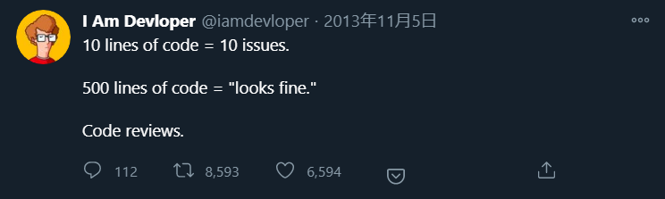

プルリクを小さくしようという記事はすでにたくさんありますね。

- [チーム開発におけるプルリクの作法 - Qiita](https://qiita.com/ikuwow/items/fb52a54c086398eb5b92#%E5%8D%81%E5%88%86%E5%B0%8F%E3%81%95%E3%81%8F%E3%83%97%E3%83%AB%E3%83%AA%E3%82%AF%E3%82%92%E4%BD%9C%E3%82%8D%E3%81%86)
- [「巨大プルリク1件vs細かいプルリク100件」問題を考える（翻訳）｜TechRacho（テックラッチョ）〜エンジニアの「？」を「！」に〜｜BPS株式会社](https://techracho.bpsinc.jp/hachi8833/2018_02_07/51095)
- [プルリクエストが最速でマージされるための７つの技 - Qiita](https://qiita.com/TsuyoshiUshio@github/items/63af5cacb3712d6f9199#%E3%83%97%E3%83%AB%E3%83%AA%E3%82%AF%E3%82%A8%E3%82%B9%E3%83%88%E3%82%92%E5%B0%8F%E3%81%95%E3%81%8F%E3%81%99%E3%82%8B)
- [レビューをもらいやすい細かいプルリクの切り分け方 - Software engineering from east direction](https://khigashigashi.hatenablog.com/entry/2018/03/09/020359)

この記事では、プルリクに関わるそれぞれの人たちの視点から、小さくするメリットをまとめてみます。

## レビュアー視点

### レビューにすぐ着手できる

レビュアーは基本的に、プルリクを受け取ったら最優先でレビューすべきです。
遅らせた分だけレビュイーのタスクを止めてしまうからです。
ただ、現実的には、プルリクが大きいとそれが難しくなります。
大きいプルリクは、逆にレビュアーのタスクを止めてしまうからです。

たとえば、私は以下のような流れでレビューに着手しています。

1. プルリクを受け取る
2. 差分のファイル数や行数を確認する
3. レビューにかかる時間を見積もる
4. すぐに終わりそうであれば、そのまま着手する
5. まとまった時間が必要そうであれば、その時間を確保できるときに着手する

自分のタスクに余裕がある場合は、プルリクが大きくてもすぐに着手しますが、そうでない場合は後回しにします。
プロジェクトの中で、そのプルリクの優先度が高い場合は、さらっとしか見ずにOKを出してしまうこともあります。
私が経験したことのある現場の数は多くないですが、海外のエンジニアですら同じようなことを呟いているので、おそらくどの現場も似たようなものなのだと思います...

https://twitter.com/iamdevloper/status/397664295875805184

### 問題を見落とす可能性が低くなる

ひとつ前の項目と重なる点もありますが、プルリクが大きくなればなるほど、レビュアーが1行に割く時間は短くなります。
10行のプルリクであれば見つけられた問題が、500行になると見つけられない可能性が高くなります。

ちなみに、レビューにかかる時間は差分の行数に対して線形的ではなく、指数的に増えます。
変更された箇所だけでなく、その変更によって影響する箇所も考える必要があるからです。

## レビュイー視点

### フィードバックをすぐに受け取れる

レビュアーがすぐに着手するようになるので、レビュイーがフィードバックを受け取るのも早くなります。
当然、時間が経つほど、レビュイー自身もプルリクを作成したときの記憶が薄くなります。
レビューに時間がかかって、コメントをもらうころにはなぜ自分がそのように実装したのか忘れてしまっていた経験はないでしょうか？
私はよくあります。
プルリクが小さければ、このようなことが少なくなります。

### 手戻りが減る

レビューされて受け取ったフィードバックが根本的な問題の場合、そのプルリクをまるごとやり直さなければいけないことがあります。
たとえば、仕様の認識が間違っていたときや、そのリポジトリのコーディング規約を満たしていなかったときなどです。
このときも、プルリクが小さければ、早めに気づくことができます。

## リポジトリオーナー視点

### 前の状態に戻しやすくなる

1つのプルリクで1つの変更だけを行っているので、「この変更を入れてみたけどやっぱり戻したい」というときに、そのプルリクをrevertするだけで済みます。
1つのプルリクで複数の変更を行っていると、他の変更も戻ってしまうので、revertできません。

### 短い周期でリリースできる

プルリクがマージされるまでの時間が短くなるので、小さい変更を入れてすぐにリリースすることが可能になります。
これによって、新しい機能を継続的にユーザへ提供できるようになります。
開発が活発であることのアピールにもなります。

## 粒度の目安

では、実際にプルリクを小さくするとして、どれくらいの大きさが適切でしょうか？
まず、以下の条件は最低限満たしたほうが良いです。

- 正常に動かせる
- 1つのタスクにのみ紐づく
- 1種類の変更のみ行っている
    - 機能追加
    - バグ修正
    - リファクタリング
    - etc

これらを満たしていない場合はプルリクが大きすぎる、または小さすぎる可能性が高いです。

満たした上で、可能な限り小さくしましょう。
実際、OSSでは1行や2行のプルリクが珍しくありません。
100行を超えるプルリクは、リポジトリオーナー自身が作成している場合以外ではあまり見ないです。
意味もなく細かくする必要はありませんが、タスクを解決するのであれば1行でも問題ありません。
（もちろん、OSSはバグ修正やドキュメント修正の割合が圧倒的に多いので、システム開発などとはまた違いますが...）

プルリクを小さくしてみんな幸せになりましょう。
