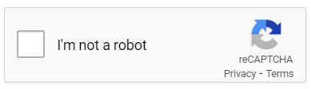

[Coinhive事件が無罪になった](https://note.com/morois/n/n04022db1f76c)。
Webエンジニアとしては、新しい技術が潰されなくて良かった。

ただ、私がCoinhiveを使うことはないと思う。
最近 Apple Pay を初めて使ったレベルなので、仮想通貨とかこわい。

Coinhiveは無断で実行されることが問題視されているらしい。
広告も無断で表示されるが、目に見える広告は問題なく、見えないCoinhiveはダメという意見が多い。

Webアプリを作ったことがある人には当たり前だが、画面に表示せずに無断で実行するスクリプトはたくさんある。
というより、ほとんどのスクリプトは無断で実行される。
今回はその中でもいろんなサイトで使われているものを挙げてみる。

なお、CoinhiveにはCPU使用率の問題もあるが、ここでは無視する。
Coinhiveの違法性（合法性）に関する議論は以下がわかりやすい。

- [高木浩光＠自宅の日記 - 懸念されていた濫用がついに始まった刑法19章の2「不正指令電磁的記録に関する罪」](http://takagi-hiromitsu.jp/diary/20180610.html)
- [コインハイブ事件の最高裁の弁論の検察側の主張がひどいことを考えた（追記あり） : なか2656のblog](https://www.naka2656-b.site/archives/31413689.html)
- [【速報】コインハイブ事件の最高裁判決で無罪判決が出される : なか2656のblog](https://www.naka2656-b.site/archives/31835597.html)

## アクセス解析

Webサイトにアクセスしたユーザの属性や行動を分析することをアクセス解析と言う。
[Google Analytics](https://marketingplatform.google.com/about/analytics/) が代表的なツールだ。おそらくほとんどのサイトで使われている。

たとえば次のような行動を取得する。

- アクセス
- スクロール
- クリック
- 動画の再生

なお、Google Analytics は無断で実行されるが、[プライバシーポリシーなどに使っている旨を記載する必要がある](https://marketingplatform.google.com/about/analytics/terms/jp/)。

ちなみにYouTubeも定期的にユーザの属性や行動をサーバに送信している。

## CAPTCHA

CAPTCHAとは、Completely Automated Public Turing test to tell Computers and Humans Apart の略で、日本語だと「完全に自動化された、コンピュータと人間を区別する公開チューリングテスト」という意味。（長い）
要するに人間かボットかを判断する仕組みで、一度は見たことがある人も多いはず。

もちろんチェックボックスへのチェックだけで判断しているわけではない。
アクセスしてからチェックされるまでの時間や、カーソルやスクロールの動きなどを見ている。
人間にはランダム性があるが、ボットは直線的なので判断できるというわけだ。

下のサイトがわかりやすい。

[「私はロボットではありません」はワンクリックでなぜ人間を判別できる？ 仕組みとその限界を聞いてきた | i:Engineer(アイエンジニア)｜パーソルテクノロジースタッフのエンジニア派遣](https://persol-tech-s.co.jp/i-engineer/technology/securitycaptcha)

つまり、それらのデータが無断で監視されている。

## Service Worker

Service Worker は、オフラインでもWebアプリを使えるようにする技術だ。
サイトにアクセスした時にコンテンツのダウンロードとキャッシュをさせることで実現している。

たとえば [Qiita](https://qiita.com/) で適当な記事を開く。機内モードなどでオフラインにする。
その状態でページを更新しても問題なく記事を読める。
Service Worker が導入されていないサイトではブラウザのエラー画面が表示される。

ユーザがアクセスしていないコンテンツでも、あらかじめ（無断で）ダウンロードさせることができる。

ちなみにバックグラウンドでデータを同期させることもできる。
Coinhiveはサイトを閉じれば止まるが、このバックグラウンド同期はブラウザを閉じても実行される。もっとやばい。

ただ、安心してほしい。バックグラウンド同期は実行時間に制限があるのでマイニングには使えない。

[Introducing Background Sync | Web | Google Developers](https://developers.google.com/web/updates/2015/12/background-sync#permissions)

> The event execution time is capped, so you can’t use them to ping a server every x seconds, mine bitcoins or whatever.

## prefetch

やたらサクサク動作するサイトはだいたいprefetchを使っている。
Service Worker と同じように、コンテンツのダウンロードとキャッシュをさせる仕組みだ。

Service Worker はサイトごとに設定するのに対して、prefetchはページごとに設定する。
たとえば、記事のリストが表示されたページにアクセスした時点で、それらの記事の内容をダウンロードさせることができる。

なお、prefetchは Resource Hints のひとつであり、他にも dns-prefetch、preconnect、prerenderがある。

下のサイトが詳しい。

[少ない手間でそのWebページに適した手法で表示高速化ができるResource Hintsがすごい｜コラム｜メンバーズ](https://blog.members.co.jp/article/33474)

これも普通はユーザに許可を取らない。

## 技術と法律

無断で実行されるスクリプトが違法かどうかは国によって違う。
上で挙げた [Google Analytics も違法な場合がある](https://gigazine.net/news/20220120-google-analytics-illegal-europe/)。

Coinhiveは勝手にCPUを使うが、動画広告は勝手に通信量を消費する。
最近話題のメタバースは個人情報の扱いが問題視されている。

技術者は、技術だけでなく法律も勉強しないといけない。
