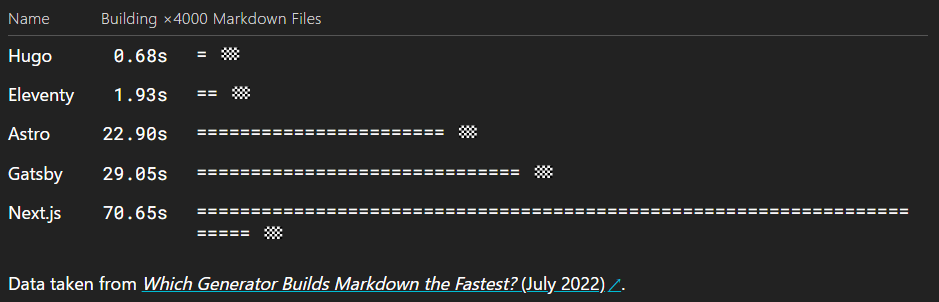

## 稼働率とリードタイムの関係

[エンジニアの稼働率を上げれば上げるほど機能リリースが遅くなっていく｜mtx2s](https://note.com/mtx2s/n/n2ca2fbf02f6b)

待ち行列理論を開発プロセスに当てはめて、稼働率が上がるほどリリースが遅くなる理由と、カンバンを使ってそれを改善する方法。
約1.5万文字の大作。

## Reactのstateがリセットされるタイミング

[Preserving and Resetting State – React](https://react.dev/learn/preserving-and-resetting-state)

特定の条件でコンポーネントのstateを初期状態に戻したいことがたまにある。
コンポーネントの `key` 属性を変えることで別のコンポーネントとして扱われ、stateもリセットできる。

## モーダルは不要

[You don't need a modal window](https://youdontneedamodalwindow.dev/)

モーダルが良くない理由まとめ。

- そもそも実装が複雑
- モーダル用のURLを用意しないとブックマークしたりシェアしたり別タブで開いたりできない
    - 用意する場合は以下の問題がある
        - 実装がさらに複雑化
        - モーダルの背景に表示する画面の検討が必要
- ブラウザバックの挙動が分かりにくい
    - サイトによって前のページに戻ることもあれば、モーダルを閉じるだけのこともある

コンテンツとして表示するときでなければ使っても良いとのこと。

- アラート
- 確認ダイアログ
- 作成/編集フォーム

## 最新の静的サイトジェネレータ

久しぶりに [フロントエンド開発者ロードマップ](https://roadmap.sh/frontend) を見てみたら、静的サイトジェネレータとしてEleventyとAstroが推されていた。
結構前から名前は見ていたが、この機会に調べてみた。

### Eleventy

[Eleventy, a simpler static site generator](https://www.11ty.dev/)

とてもシンプルな静的サイトジェネレータ。
HTMLやMarkdownなどでテンプレートを書いて、静的サイトにビルドするだけ。
TypeScriptをサポートしておらず、クライアント側で動く処理を書くのも少し面倒。
その代わりビルドが爆速。

[Performance — Eleventy](https://www.11ty.dev/docs/performance/#build-performance)

本当に静的なサイトであれば選択肢に入りそう。

### Astro

[Astro](https://astro.build/)

Eleventyと同じくMPAの静的サイトジェネレータ。
こちらはデフォルトでTypeScriptをサポートしている。
ただ、"Zero JS" という特徴を持っていて、JS/TSを書いてもビルド時にスクリプト適用後の静的なHTMLに変換される。
属性を指定することで変換せずにクライアント側で動かすこともできる。

このブログを作るのに使っているGatsbyは、ルーティングが直感的でなかったり、GraphQLを使う必要があったりして割とクセがある。
Astroであればファイルがそのままルートになり、GraphQLも不要なので簡単。
ただ、Markdown内の画像を自動で最適化してくれない、prefetchはプラグインが必要、フォントのpreloadを埋め込んでくれるプラグインが存在しないなど、まだ厳しそう。
これらが不要なサイトであれば現時点で最強のフレームワークだと思う。

## htopコマンド

[htop - an interactive process viewer](https://htop.dev/index.html)

Linuxでシステムの状態を確認するコマンド `top` を使いやすくしたもの。
CPUやメモリの使用率がグラフで表示されたり、killが数値入力ではなく選択式だったりで使いやすい。
いくつかのOSでは最初からインストールされていて、されていなくてもパッケージマネージャからすぐに入れられる。
