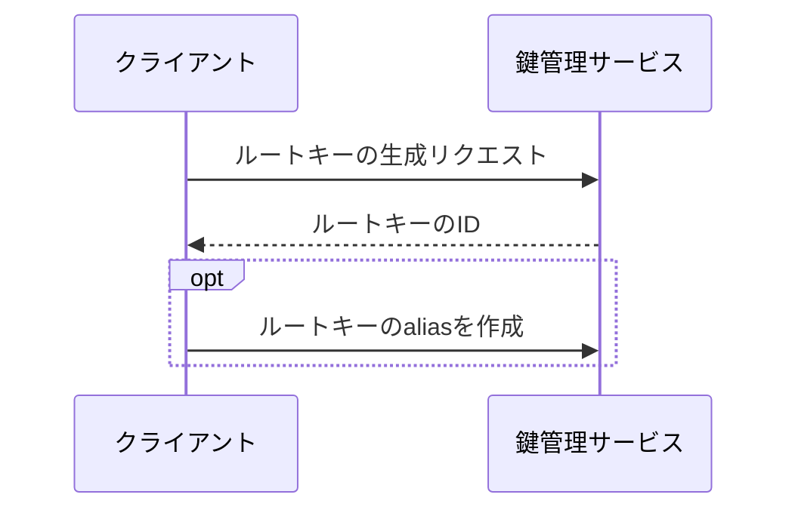
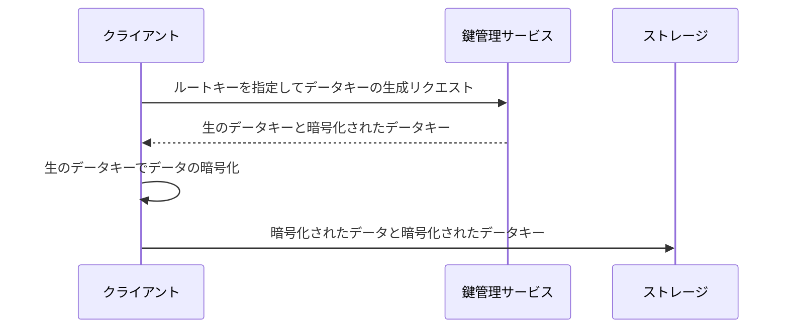
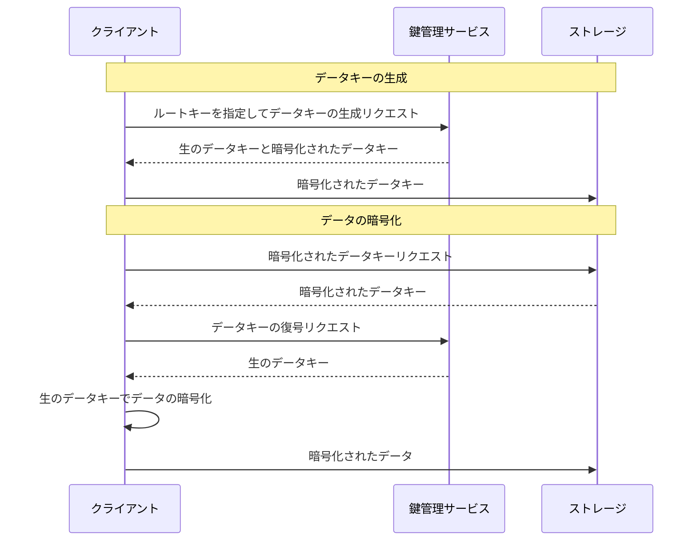
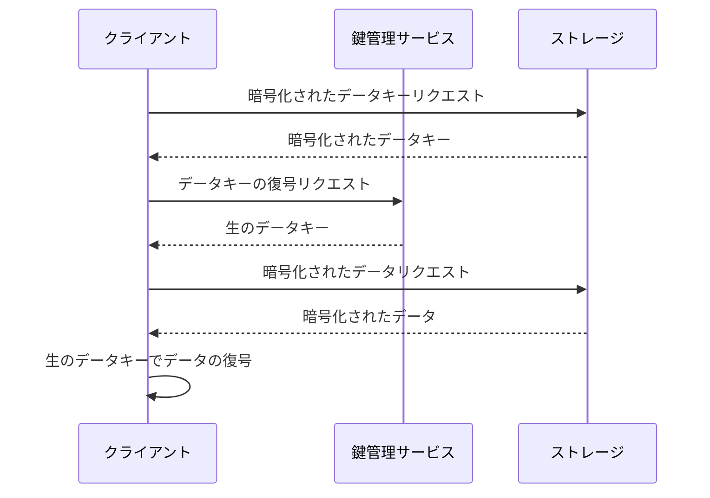
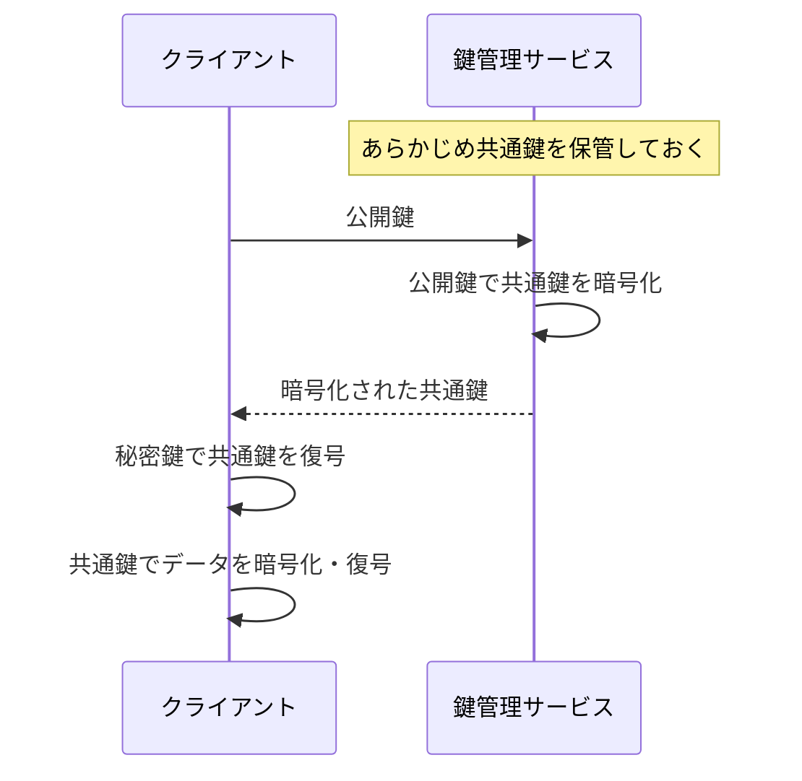

だいぶ更新をさぼっていたので多め。今週と言いつつ数か月分。

## エンベロープ暗号化

[エンベロープ暗号化  |  Cloud KMS ドキュメント  |  Google Cloud](https://cloud.google.com/kms/docs/envelope-encryption?hl=ja)

公開鍵は暗号化・復号の処理が重いため、大きいデータの暗号化には共通鍵を使うのが一般的。
しかし、共通鍵をそのまま保管すると流出したときにデータが復号されてしまう。
共通鍵自体も暗号化して保管し、共通鍵の暗号化に使った鍵を別の安全な場所に保管しておくことで、パフォーマンスと安全性の両方を満たせる。
この方法をエンベロープ暗号化という。

それぞれの鍵は以下の特徴を持つ。

- データキー（データ鍵、データ暗号鍵）
    - データを暗号化・復号するための鍵
    - 暗号化したデータキーはアクセスしやすい場所に保管する
        - 流出しないに越したことはないが、鍵が復号できなければデータも復号できないので、流出しても問題ない
    - 暗号化していないデータキーは保管しない
        - 流出するとデータを復号できてしまうため
- ルートキー（ルート鍵、鍵暗号鍵）
    - データキーを暗号化・復号するための鍵
    - 安全な場所で管理し、外に出さない

AWS KMS での流れをまとめる。

まず、ルートキーを生成する。

ルートキーのIDまたはaliasは、環境変数や設定ファイルなどに持っておく。

データキーの生成とデータの暗号化を同時に行うときは以下のようになる。

データキーの生成とデータの暗号化が別のタイミングだと以下のようになる。

復号の流れは以下の通り。

なお、似たような方法にハイブリッド暗号方式というものがある。

データの暗号化に共通鍵を使い、その鍵をさらに暗号化するという点は同じ。
しかし、エンベロープ暗号化にはいくつか利点がある。

- データによって暗号化する鍵を変えたいとき、鍵管理サービスで管理する鍵の数が、
    - ハイブリッド暗号方式はその分だけ増える
    - エンベロープ暗号化はルートキー1つのみ
        - ルートキー1つから複数のデータキーを生成できて、データキーはクライアントが管理するため
- クライアント側で扱う鍵の種類が、
    - ハイブリッド暗号方式は登場するすべて
        - 流出するリスクがある
    - エンベロープ暗号化はデータキーのみ
        - ルートキーが流出しにくい
            - クライアントより鍵管理サービスのほうが流出しにくい前提

## AWS

### Mountpoint for Amazon S3

[Mountpoint for Amazon S3 – 一般公開されており、本番環境のワークロードにも対応可能 | Amazon Web Services ブログ](https://aws.amazon.com/jp/blogs/news/mountpoint-for-amazon-s3-generally-available-and-ready-for-production-workloads/)

EC2上にS3バケットをマウントする機能。
S3のAPIではなくLinuxのコマンドで操作できて、既存のツールから扱いやすくなる。
Mountpoint for Amazon S3 自体は無料で、S3を使用した分の料金しかかからない。

ファイルの新規作成はできるが、更新はできないなど、すべての操作ができるわけではないので注意。

### Amazon S3 Object Lambda

[Amazon S3 の機能 | Object Lambda | AWS](https://aws.amazon.com/jp/s3/features/object-lambda/)

S3からデータを取得するときにLambdaの処理を経由させる機能。
主なユースケースは以下の通り。

- 機密情報の削除・マスキング
- フォーマットの変換
    - JSONをYAMLにするなど
- 圧縮・解凍
- 画像のリサイズ
- 特定の行のみを抽出

### S3のストレージクラス

https://github.com/Foo-x/til/blob/4d09aeec57898e36cd5e337d8cd703cc554613d5/service/aws/s3/%E3%82%B9%E3%83%88%E3%83%AC%E3%83%BC%E3%82%B8%E3%82%AF%E3%83%A9%E3%82%B9.md

S3のストレージクラスまとめ。

### S3の Cold HDD の最小サイズ

https://github.com/Foo-x/til/blob/4d09aeec57898e36cd5e337d8cd703cc554613d5/service/aws/ebs/ColdHDD%E3%81%AE%E6%9C%80%E5%B0%8F%E3%82%B5%E3%82%A4%E3%82%BA.md

S3の Cold HDD は最小サイズが大きめなので注意すべきということ。

### 複数リージョンでの冗長化

https://github.com/Foo-x/til/blob/4d09aeec57898e36cd5e337d8cd703cc554613d5/service/aws/%E8%A4%87%E6%95%B0%E3%83%AA%E3%83%BC%E3%82%B8%E3%83%A7%E3%83%B3%E3%81%A7%E3%81%AE%E5%86%97%E9%95%B7%E5%8C%96.md

複数リージョンで冗長化する方法。

### NAT

https://github.com/Foo-x/til/blob/4d09aeec57898e36cd5e337d8cd703cc554613d5/service/aws/NAT.md

プライベートサブネットからNATを使ってインターネットにアクセスする方法。

### EC2の購入オプション

https://github.com/Foo-x/til/blob/4d09aeec57898e36cd5e337d8cd703cc554613d5/service/aws/ec2/%E8%B3%BC%E5%85%A5%E3%82%AA%E3%83%97%E3%82%B7%E3%83%A7%E3%83%B3.md

EC2の購入オプションまとめ。

### SQSのユースケース

https://github.com/Foo-x/til/blob/4d09aeec57898e36cd5e337d8cd703cc554613d5/service/aws/sqs/%E3%83%A6%E3%83%BC%E3%82%B9%E3%82%B1%E3%83%BC%E3%82%B9.md

SQSのユースケースまとめ。

### RDSのリードレプリカ

https://github.com/Foo-x/til/blob/4d09aeec57898e36cd5e337d8cd703cc554613d5/service/aws/rds/%E3%83%AA%E3%83%BC%E3%83%89%E3%83%AC%E3%83%97%E3%83%AA%E3%82%AB.md

RDSのリードレプリカについて。

### ALBのパスベースルーティング

https://github.com/Foo-x/til/blob/4d09aeec57898e36cd5e337d8cd703cc554613d5/service/aws/elb/%E3%83%91%E3%82%B9%E3%81%AB%E5%BF%9C%E3%81%98%E3%81%A6%E3%82%BF%E3%83%BC%E3%82%B2%E3%83%83%E3%83%88%E3%82%92%E5%A4%89%E3%81%88%E3%82%8B.md

ALBではパスに応じて転送先を変えられること。

## Docker

### 同じタグのイメージをpullしなおす

https://github.com/Foo-x/til/blob/80299e40907f492ec5b1ff14746a58f8b30a76d2/infra/docker/%E5%90%8C%E3%81%98%E3%82%BF%E3%82%B0%E3%81%AE%E3%82%A4%E3%83%A1%E3%83%BC%E3%82%B8%E3%82%92pull%E3%81%97%E3%81%AA%E3%81%8A%E3%81%99.md

一度pullしたイメージを再度pullする必要性。

### 複数Composeファイル

https://github.com/Foo-x/til/blob/80299e40907f492ec5b1ff14746a58f8b30a76d2/infra/docker/%E8%A4%87%E6%95%B0%E3%81%AECompose%E3%83%95%E3%82%A1%E3%82%A4%E3%83%AB%E3%82%92%E4%BD%BF%E7%94%A8.md

Docker Compose で複数のComposeファイルを指定したときの挙動とユースケース。

### WSL + Docker CE でDevcontainerを使う

https://github.com/Foo-x/til/blob/9727354e860616345f1771e2ad69a2429418db73/tool/devcontainer/%E8%A4%87%E6%95%B0%E3%82%B3%E3%83%B3%E3%83%86%E3%83%8A%E3%81%AB%E6%8E%A5%E7%B6%9A%E3%81%99%E3%82%8B.md

WSL + Docker CE だとDevcontainerがエラーになることがある。その解決法。

## Excel

### DOVパターン

https://github.com/Foo-x/til/blob/4efae300328d92d4f92ea3c391f4a381fc9dfd61/tool/excel/DOV%E3%83%91%E3%82%BF%E3%83%BC%E3%83%B3.md

エクセルのデータを再利用しやすく、変更に強くする方法。

### 選択範囲をずらす

https://github.com/Foo-x/til/blob/4d09aeec57898e36cd5e337d8cd703cc554613d5/tool/excel/%E9%81%B8%E6%8A%9E%E7%AF%84%E5%9B%B2%E3%82%92%E3%81%9A%E3%82%89%E3%81%99.md

同じ大きさのまま選択範囲を隣にずらす方法。

## Outlook

### 遅延送信

https://github.com/Foo-x/til/blob/9727354e860616345f1771e2ad69a2429418db73/tool/outlook/%E9%81%85%E5%BB%B6%E9%80%81%E4%BF%A1.md

Windows版Outlookで遅延送信する方法。

### カレンダーに祝日を表示

https://github.com/Foo-x/til/blob/9727354e860616345f1771e2ad69a2429418db73/tool/outlook/%E3%82%AB%E3%83%AC%E3%83%B3%E3%83%80%E3%83%BC%E3%81%AB%E7%A5%9D%E6%97%A5%E3%82%92%E8%A1%A8%E7%A4%BA.md

カレンダーに祝日を表示させる方法。

## Gitでファイルを無視する

https://github.com/Foo-x/til/blob/9e907fef2a499f00c04cd06cbc7ad5eb739e817a/tool/git/%E3%83%95%E3%82%A1%E3%82%A4%E3%83%AB%E3%82%92%E7%84%A1%E8%A6%96%E3%81%99%E3%82%8B.md

Gitでファイルを無視する各方法の違い。

## ReactのStrictモード

https://github.com/Foo-x/til/blob/78b9f73c9c64c98e03b1200b7d0758673d81f0d7/language/javascript_typescript/react/Strict%E3%83%A2%E3%83%BC%E3%83%89.md

ReactのStrictモードについて。

## ブラウザのタブ検索

https://github.com/Foo-x/til/blob/80299e40907f492ec5b1ff14746a58f8b30a76d2/tool/chromium/%E3%82%BF%E3%83%96%E6%A4%9C%E7%B4%A2.md

タブを検索するショートカットキー。
