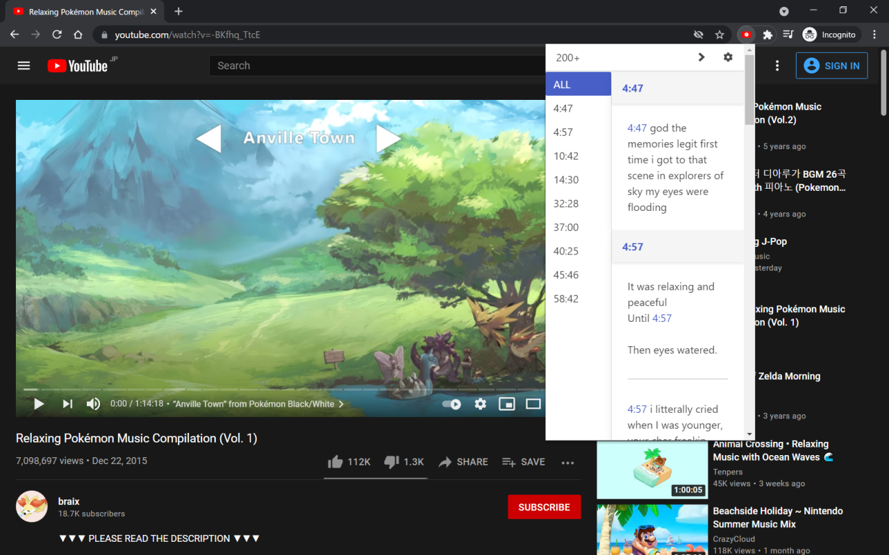

- ストアページ
    - https://chrome.google.com/webstore/detail/youtube-timestamp-comment/khngjoedfeicfbjlcfmiigbokbnlibei
- リポジトリ
    - https://github.com/Foo-x/youtube-timestamp-comments

## YouTube Timestamp Comments について

`1:23` のような時間指定コメントをソートして表示する Google Chrome 拡張機能です。

現在の YouTube の仕様には以下の問題があると考えています。

- 時間指定コメントのみを表示することができない
- 時間順でソートすることができない
- 時間をクリックするとスクロール位置が一番上に戻ってしまう
    - 他のコメントを読みたいときに毎回スクロールしなおす必要がある

この拡張機能は、これらを解決するものです。

## 変更点

今回の更新に機能的な変更はありません。以下は技術的な変更点のみです。

### YouTube Data API を使うようにした

v0.5.0 までは、以下のように少しhackな方法でコメントを取得していました。

1. グローバルオブジェクトから認証情報を取得
2. YouTube のクライアント側がリクエストしているURLに対して、上の認証情報を送信

この方法を採用したのは、使用者に作業を強制することを避けたからです。
公式のAPIを使うには、APIキーを用意する必要があります。

しかし、これは YouTube の仕様変更に弱く、実際に動かなくなったこともあります。
最終的にはリクエスト先のURLとレスポンスのI/Fがまったく異なるものになり、ほぼ作り直すことになってしまいました。

以上から、使用者にAPIキーを準備していただく必要はありますが、安定動作を実現するために公式のAPIを使うことにしました。

### TypeScript + React に移行した

更新前は [Elm](https://elm-lang.org/) を使っていました。
ランタイムエラーが発生しないこと、シンプルなアーキテクチャ、パターンマッチやパイプラインといった便利な構文、親切なコンパイラなどが魅力でした。

しかし、開発の遅さが気になります。2018年8月に約2年ぶりのリリースがあってから、現在まで3年以上も機能の更新がありません。

今回のタイミングに合わせて TypeScript とReactに移行することにしました。
ただ、The Elm Architecture はReactと相性が良いこともあるので、アーキテクチャはそのままです。
